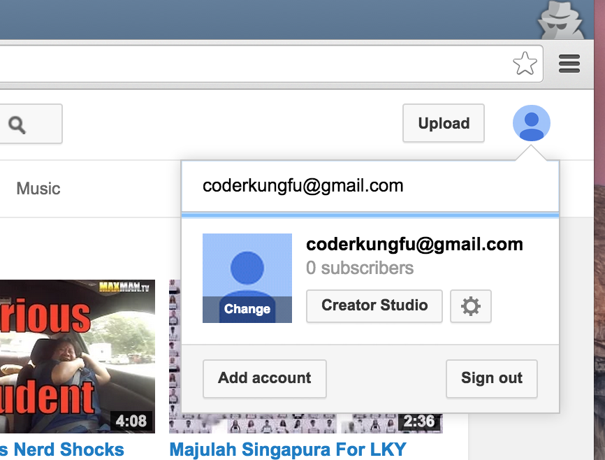
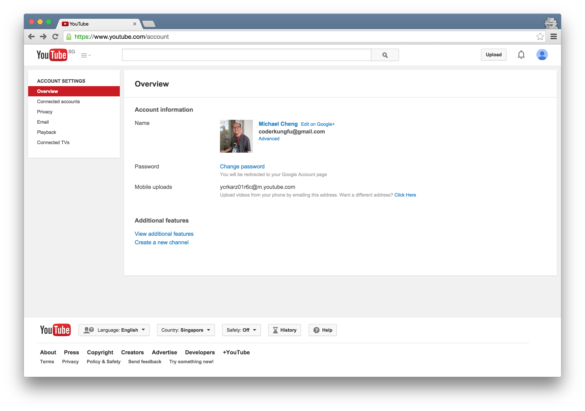
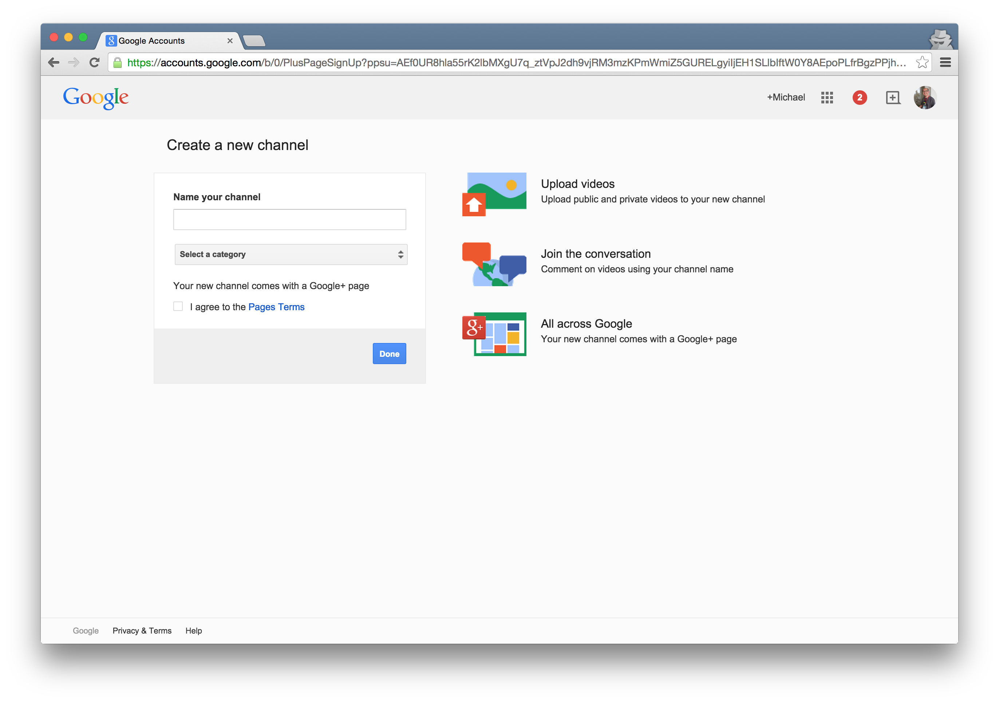

# Create a YouTube Channel

1. Sign in to your Google Account.
2. Go to [YouTube.com](http://youtube.com)
3. Go to your [account page](https://www.youtube.com/account)

	
	

4. Click on "Create Channel". Follow through. This will create your Google Plus Page. Feel free to update your avatar as well.

	

5. You will need to verify your account if you wish to do upload clips more than 15 minutes. You will see the link when you upload your first video.

	
	