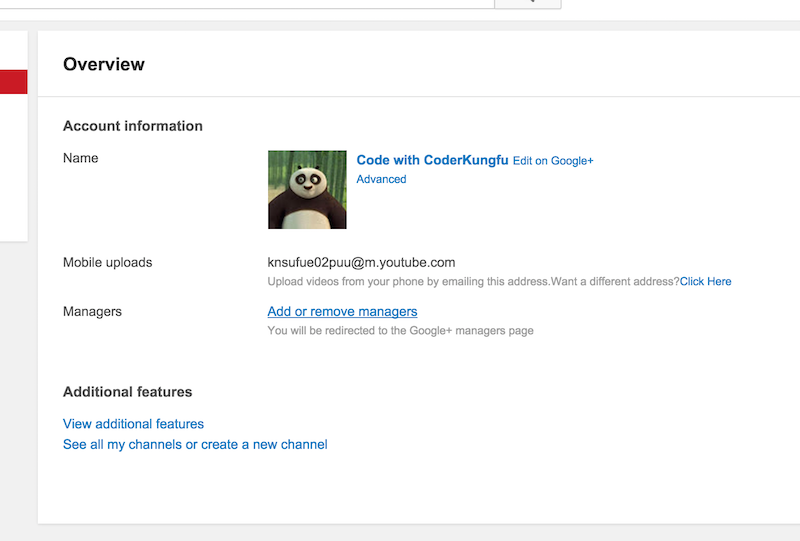
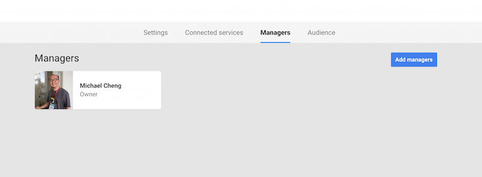
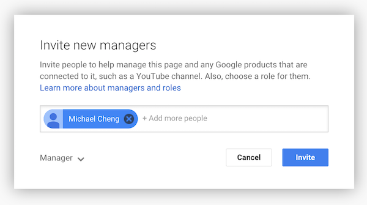
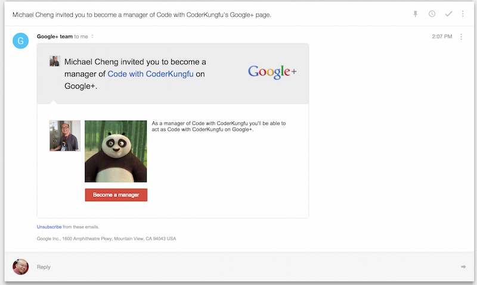

# Add other managers to your YouTube Channel

1. Click on "YouTube Settings"
	
	

2. Click on "Add or remove managers"

	

3. Click on "Add Manager"

	

4. Enter their Gmail account (must have Google Plus profile).

	

5. Recipient receives the email and approves the add.

	

6. They should be able to see the channel settings now. 