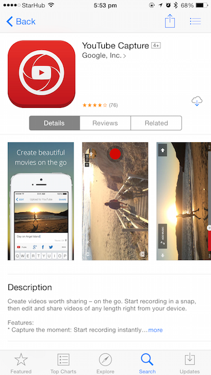
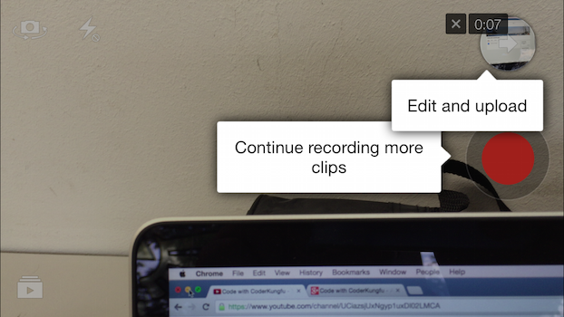
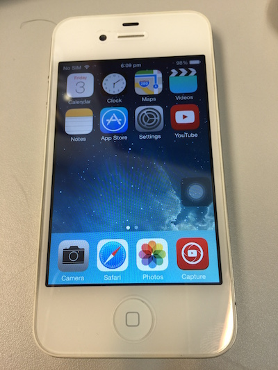

# Basic - Using your phone

## Introduction

The easiest way of capturing meetup videos is to with your phone's camera. The image quality is good and the sound quality can be pretty decent. Phones are build to capture audio surprisingly well. This is probably also the cheapest way to do so. 

You can upload the video after the meetup is over by uploading to your computer and use the [YouTube upload page](https://www.youtube.com/upload) to upload the file. Fortunately there is an app that can let you record and upload to your YouTube Channel directly from the phone, the [YouTube Capture](https://www.youtube.com/capture) app. Unfortunately, it is an iOS only app.

## Steps

1. Download the [YouTube Capture app](https://www.youtube.com/capture). *(Sorry, iOS only)*

	

2. Login to your Google Account. Select your channel.

	
	

2. Record video of speaker / projector slides.

	
	
	 *You can stop and record multiple videos.*

3. Trim or edit the video.

	

4. Upload the video from the phone. Use a wifi connection if possible because its going to upload alot of data.

	

5. ***Profit!***

	

## Things to Note

 *Works on iPhone 4*

 *Use a tripod & a phone mount. Phone mount costs $3 at Funan.*

 *Uploading from the phone might take some time. Extend the sleep time to the longest, because when the phone goes to sleep, the upload will stop.*

## Example Footages

 *This was shot hand-held style, without a tripod (thus the shakiness). Notice the audio faded in and out somewhere in the middle. This because i accidentally covered the microphone on the phone. :(*

 *This is shot with a tripod. But since I am recording the speaker only, viewers might find it hard to follow. So maybe a better way is to just videograph the screen?*

 *Example of something shot using the YouTube Capture app on an iPad mini. No tripod was used, but the iPad cover I used was able to prop up the iPad mini.*