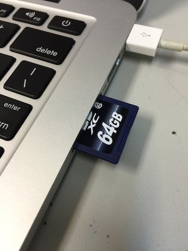
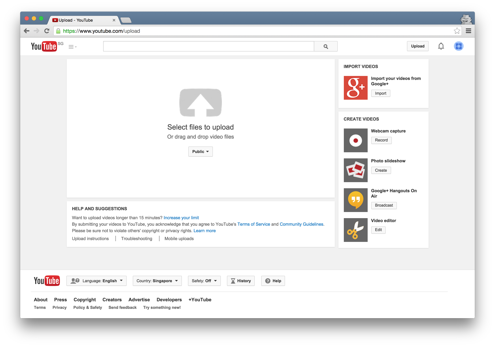

# Basic - Using 1 camera

## Steps
1. Shoot video on an external camera. Something that saves to a HDD or SD card. We recommend using the [Zoom Q4](http://www.zoom.co.jp/products/q4). Its costs SGD$409.50 at [City Music](http://www.citymusic.com.sg/webshaper/store/viewProd.asp?pkProductItem=1124).

	 *On tripod.*

	 *LCD display view finder.*

	 *Microphones.*

2. Transfer the file to computer and upload via [YouTube Upload Page](https://www.youtube.com/upload).

	

	

	

3. ***Profit!***

## Example Footages

 *Shot with the video camera only.*