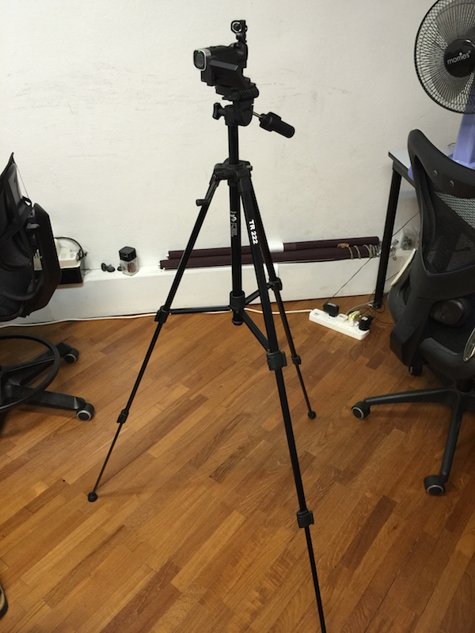
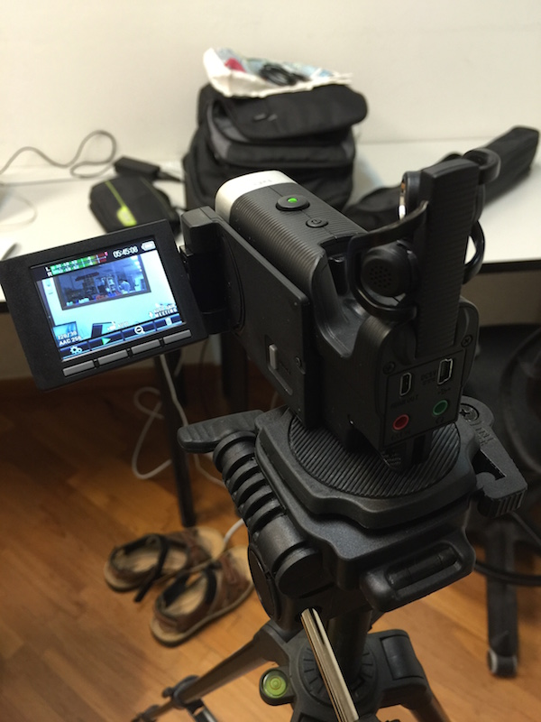
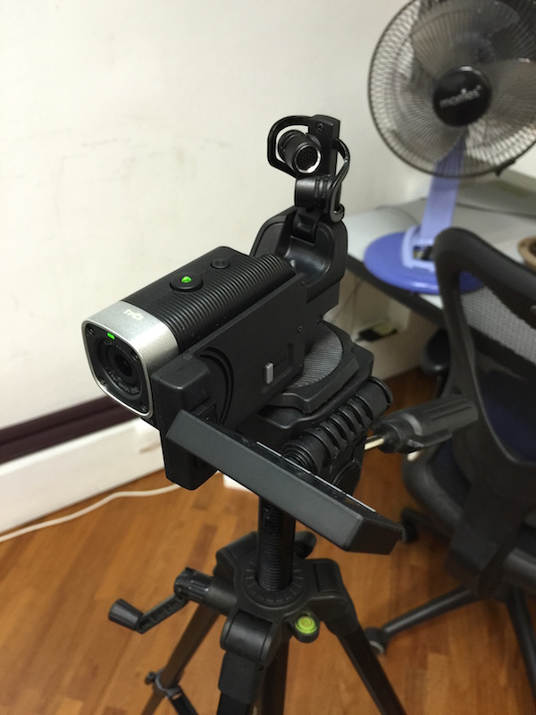
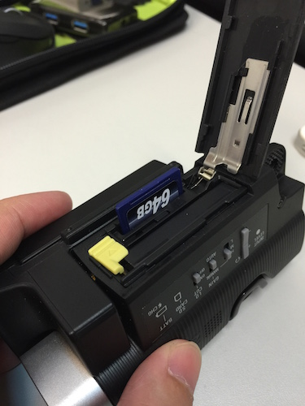

# Intermediate - Using 1 camera

## Introduction

For better sound quality, we prefer to use an external camera. You can get a consumer grade camera that records into a SD card or hard drive. These videos are easier to retrieve and do upload.

However, we also found some pretty easy to use digital cameras with professional grade microphones from Zoom. They shoot videos in high-def (720p, 1080p at 30 - 60 FPS). Very decent for recording meetups with clear crisp sound from the speaker.

## Steps
1. Shoot video on an external camera. Something that saves to a HDD or SD card. We recommend using the [Zoom Q4](http://www.zoom.co.jp/products/q4). Its costs SGD$409.50 at [City Music](http://www.citymusic.com.sg/webshaper/store/viewProd.asp?pkProductItem=1124). *(The tripod costs between $16 to $25 from Mustafa Centre)*.

	 *On tripod.*

	 *LCD display view finder.*

	 *Microphones.*

2. Transfer the file to computer and upload via [YouTube Upload Page](https://www.youtube.com/upload).

	

	

	

3. ***Profit!***

## Example Footages

 *The first video we ever shot - done with a [Zoom Q2HD](http://www.zoom.co.jp/products/q2hd).*

 *Also with the [Zoom Q2HD](http://www.zoom.co.jp/products/q2hd).*

 *Shot with the [Zoom Q4](http://www.zoom.co.jp/products/q4).*