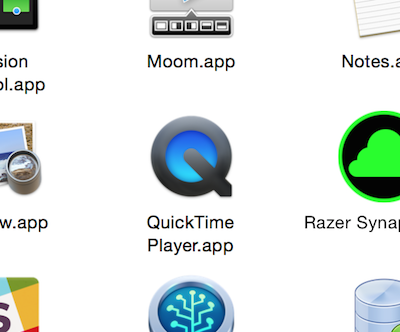
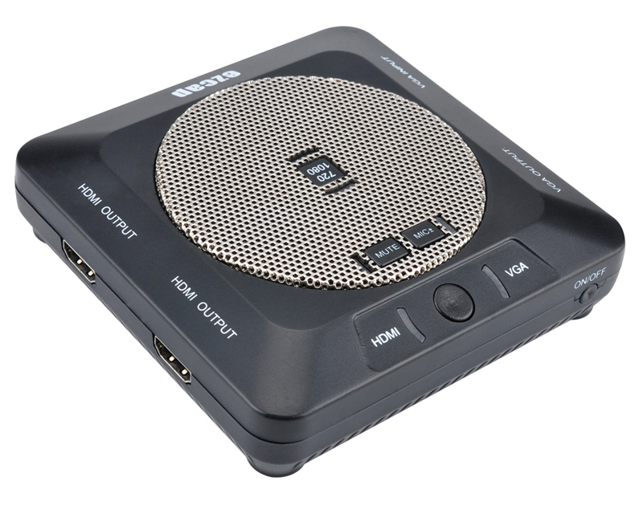
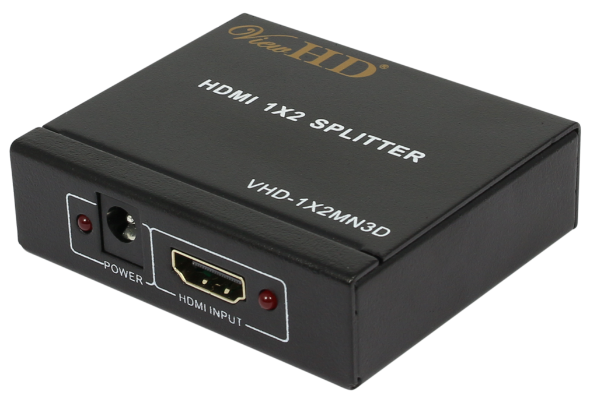
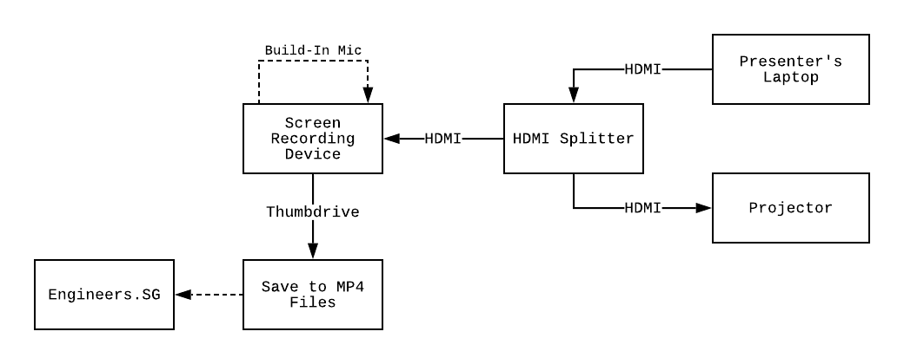

# Intermediate - Record Screen Capture

## Option 1: QuickTime Screen Recording

When the speaker is using a Mac, you can easily record their screen activities. This way, you get very sharp and high quality recording. This option is rather intrusive. So only do this if you meet the speaker earlier and make the arrangements before the start of his talk.

### Steps

1. Start QuickTime Player

	

2. Select: File > New Screen Recording

	

3. Set the audio source of the video to "Build-In Microphone: Internal Microphone". This is to ensure you capture the speaker's voice together with the video.

	

4. Click on record. Select the screen you wish to record.

	

5. The stop recording button is in the menu bar.

	

6. Remember to save the recording!

7. Copy the file out of the speaker's laptop and upload to your YouTube Channel.

8. ***Profit!***

### Example Footages

## Option 2: PC-free Screen Recording

In order to maintain our non-intrusion principle, we have also devised a stand-alone screen recording setup.

### Components

- [ezcap289](https://www.aliexpress.com/item/32836902435.html) - standalone screen recording device with build-in microphone. Video recording files are saved to USB thumbdrive.

	

- [ViewHD HDMI Splitter](https://u9ltd.myshopify.com/products/vhd-1x2mn3d)

	

- USB thumbdrive (formatted to FAT16 or FAT32) - to save the video recording filess.
- HDMI cables - for connecting from the presenter's laptop to the ezcap.

### Schematic

