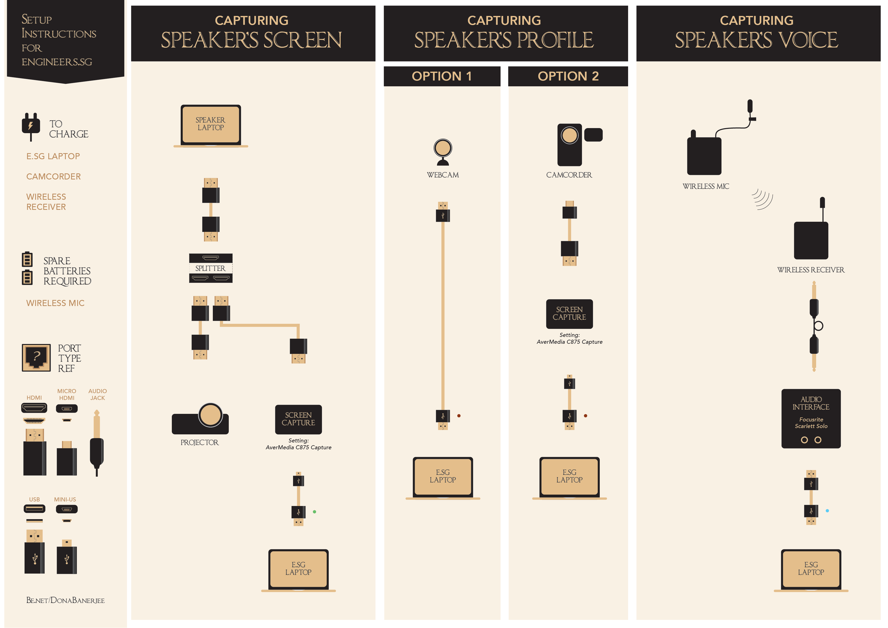
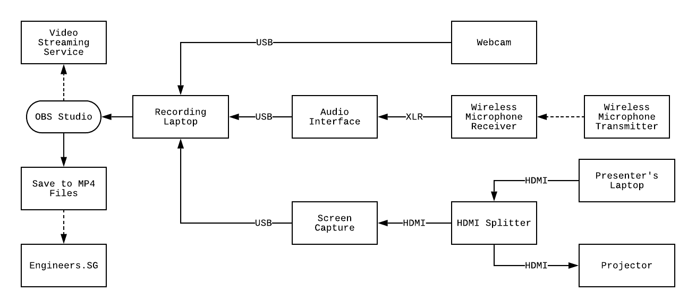

# Engineers.SG Recording Unit - Setup Guide Book

## Packing List

The recording unit's suitcase should consist of the following items:

- Laptop + charger
- HDMI cables (usually 2 cables)
- HDMI Adapters:
	- VGA to HDMI (a USB cable is attached)
	- Display Port to HDMI
	- Mini Display Port to HDMI
	- USB-C to HDMI
	- HDMI to VGA
- Video recording equipment:
	- Logitech Webcam (brown colored dot)
	- USB extension cable for the webcam (optional)
	- Sony Handycam + charger (backup camera)
- Audio recording gear:
	- Wireless lavalier microphone (receiver)
	- Spare batteries
- Equipment Organizer (blue platform):
	- HDMI splitter + power adapter
	- Screen capture device (Avermedia Live Gamer Portable) + mini-USB cable (green colored dot)
	- Audio interface (Focusrite Scarlett Solo) + red USB cable (blue colored dot)
	- Wireless microphone receiver + micro-USB cable + charger
- 2 camera stands:
	- Usually 1 tripod (for webcam) and 1 monopod (for the backup camera).
- Power Strip

## Visual Guide

*Courtesy of Dona Banerjee ([@DonaBanerjee](https://github.com/DonaBanerjee))*

## Setup Procedure

1. Find a suitable location to setup the recording equipment.
	- Take note of where the video cable for the projector is located.
	- Take note of where the nearest power socket is located (relative to the video cable).
	- Does the venue have a table for you to place your equipment? If not, get a stable chair.

2. Setup power strip.

3. Setup the HDMI splitter + HDMI cables.
	- This is so that presenter & organizers can check that their laptops are compatible with our setup as well as the projector's resolution.
	- If its not realistic to keep the splitter on the equipment organizer, just remove it and position it near the speaker + video cable for the projector.

4. 	Place the laptop (do not switch on yet) and connect the charger (start the power).
5. Setup the tripod + webcam.
6. Setup the equipment organizer.
	- Connect all the USB cables (blue, green & brown dot) to the laptop.
	- Connect the micro USB charger to the wireless microphone receiver.
	- Connect the HDMI cable to the screen capture device (if the splitter is not on the blue platform).
7. Setup the wireless microphone transmitter.
	- Attach the lapel microphone.
	- Switch on and check battery level (at the receiver).
	- The audio interface should also light up (green LED ring around the audio knob) when you speak into the microphone.

8. Start the laptop & start OBS Studio.
9. Check that you have a good capture.
	- Ensure that you are getting video feed from the webcam, screen capture device (ensure a laptop is connected for presentation).
	- Ensure that you are getting a good audio feed from the wireless lapel microphone (green audio level bar should hover around 50-80% when presenter is speaking).
10. Try a test recording & verify that you can produce the video file.

### Schematic (normal meetup recording)

## Start Recording

### To start:

Launch OBS Studio by double-clicking on the black logo that looks like a fan on the desktop.

### Before you start:

- Help the presenter to wear the wireless microphone.
- Help the presenter to connect their laptop to the recording system. We only use HDMI - find a suitable adapter if the presenter's laptop does not have HDMI output. Make sure his presentation is projected on the screen and captured in our recording setup.
- Is the screen capture okay and reflects what is currently on the projector screen?
- Is the video feed okay? Move your hands in front of the camera to see motion.
- Is the audio levels okay? Ensure the levels stays in the green and yellow zone.
- Optional - but good to try before any of the presenters start:
	- You can try to record a short clip to see if it records properly. Playback the video to check the audio levels and screen motion.

### Start recording:

- Click on "Start Recording" to start recording. It is okay to start a little earlier and capture a few seconds before he starts - better to have more footage than miss out something.
- Ensure that the screen capture did not freeze throughout the presentation.
- Check on the file size - ensure it’s growing.

### During presentation:

- Make sure the presenter is always in view in the video feed. Follow him with the Webcam if he moves around.
- Change scenes appropriately to focus on the presentation or the speaker.
- Usually for Q&A session, use the "Video Only" scene.

### End of presentation:

After the presentation (and perhaps the Q&A session), do remember to stop the recording.
Retrieve the wireless mic from the speaker. You can also help to disconnect the HDMI cable 
Remember to click on 'Start Recording" again before each speaker starts.

## Troubleshooting

1. If the screen freezes (doesn't show the presenter's screen or shows black screen).
	
	- **Possibility A: Capture buffer needs to be reset**
		1. Double-click on the "Screen Capture" source.
		2. Click on "Deactivate" and "Activate" again.

	- **Possibility B: HDMI Splitter has signal issues**
		1. Pull out all the HDMI cables connected to the splitter.
		2. Pull out the power cable.
		3. Reconnect the power cable.
		4. Connect the HDMI cables in this sequence:
			1. Presenter's laptop.
			2. Screen Capture Tool (Avermedia).
			3. Projector.
		4. Make sure you see signal light (red LED lights up) in all the HDMI connections.

	- **Possibility C: Needs to hard reset on screen capture tool**
		- If you don't see that, try to pull out and plug in the screen capture USB cable.
		- This might require you to stop recording and restart OBS.

	- **Possibility D: Something else has gone wrong - just restart OBS**
		- Restart OBS Studio.
		- Restart the laptop.

2. If the audio is suddenly off.

	- **Possibility A: Cables may have accidentally got disconnected**
		- Check that the cables are attached okay.
		- You can try to pull out and reconnect the USB cable.

	- **Possibility B: Speaker accidentally muted the microphone**
		- Ensure that the speaker did not accidentally turn off the or mute the wireless microphone.
		- You can usually unmute the mic from the receiver.

	- **Possibility C: Transmitter pack is out of batteries**
		- Make sure there is enough battery in the audio transmitter.
		- There should be replacement batteries in the set.

## Uploading Videos to Engineers.SG

### Option 1 - Small files

If your recorded MP4 files are below 1.5GB each, you may upload using the volunteers upload site: [http://upload.engineers.sg](http://upload.engineers.sg)

The login credentials will be shared with you during the volunteers training session.

After uploading, the video should appear on the website and YouTube Channel within 1 hour.

### Option 2 - Large files

If your recorded MP4 files are >= 1.5GB each, please upload the file to us via this Dropbox upload link: [http://bit.ly/esg-upload](http://bit.ly/esg-upload)

And inform us through the Telegram chat or via email to admin@engineers.sg.Do give us some time to process and upload the video. We will inform you when the videos are available on our website and YouTube Channel.

### Option 3 - Manager access to YouTube Channel

In some situations, we can grant you Manager access to the YouTube Channel so that you can upload the file directly to our YouTube Channel.

When uploading files for meetups, do remember to add the video file to the ["Meetup Videos"](https://www.youtube.com/playlist?list=PLECEw2eFfW7hYMucZmsrryV_9nIc485P1) playlist.