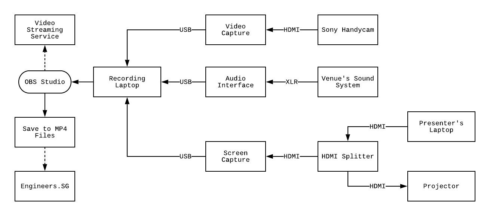

# How do we do it?

Our recording philosophy is to have minimal invasion on the presenter's laptop. Which means no installation of software or drivers for the presenter's laptop.

## Hardware

As at 2018, this is the standard gear found in our recording sets

1. **Laptop running Windows 7 Professional (Recording Laptop)**
	
	We use Windows because the drivers for our screen capture tool works best with OBS on Windows. Also, with Windows, you get access to the [Intel Quick Sync video encoder](https://en.wikipedia.org/wiki/Intel_Quick_Sync_Video). Using this encoder for OBS, drastically reduces the CPU usage when recording.

2. **[Avermedia Live Gamer Portable](https://www.avermedia.com/gaming/product/game_capture/live_gamer_portable) (Screen Capture)**

	This is our preferred screen capture / frame grabber tool. We use this to capture the presenter's screen in high resolution. This device can support up to 1080p at 60FPS. We like this device because of its robust support for different screen resolutions and aspect ratio (4x3 & 16x9) - especially helpful when you have little control over what the venue and presenters use for presentation.

3. **[ViewHD HDMI Splitter](https://u9ltd.myshopify.com/products/vhd-1x2mn3d)**

	This is to split the video signal from the presenter's laptop into 2 output - one for our screen capture tool and another directly to the projector screen. Even though the Avermedia Live Gamer Portable has a passthrough HDMI output, having a separate & dedicated splitter gives us more options for placement of our gear (without being tethered by the short length of the USB cable).

	This particular brand & model of HDMI splitter also has HDCP stripping capabilities.
	
4. **[Logitech C9xx Webcam](https://www.logitech.com/en-sg/product/c922-pro-stream-webcam)**

	We use the professional range of Logitech webcam as it has better lenses and autofocus feature. This gives us pretty clear video images when used in a small room.

	For conference recording, we usually go with something better like a Sony Handycam.

5. **[Focusrite Scarlett Solo](https://focusrite.com/usb-audio-interface/scarlett/scarlett-solo) (Audio Interface)**

	We don't use the laptop's build in sound card because its really quite crappy and can be subjected to line level distortions. We like the Focusrite Scarlett Solo because it has knobs for real time control of the recording volume (gains control). This has an XLR and 1/4 inch line input which gives us more flexibility with the type of microphones we use (either a condenser mic or wireless lapel mic). It also gives us the option to interface with the venue's sound system if need be.

6. **[RØDELink Filmmaker Kit](http://www.rode.com/wireless/filmmaker) (Wireless Lavalier Microphone)**

	A very good mid-range wireless lavalier microphone. We use this for [close miking](https://ledgernote.com/columns/studio-recording/close-miking/) of the presenter (clipped on the collar or shirt) to get the best quality audio recording. We understand that not all speakers will sit at the table to give their presentation. So a wireless mic is best suited for everyone - especially those who likes to walk around.

	We have considered cheaper lapel microphones such as [BOYA BY-WM4](http://www.boya-mic.com/wirelessmicrophonesystem/517.html) but it has a problem with intermitten dropping audio due to radio frequency disruption (even at close range). Another candidate we are considering to replace the Scarlett Solo is the [Samson Go Mic Mobile Lavalier Wireless System](http://www.samsontech.com/samson/products/wireless-systems/gomicmobile/gomicmobilelavsys/). Field tests has been promising so far.

7. **[Sony Handycam](https://www.sony.com.sg/electronics/camcorders/t/handycam-camcorders) (Backup Camera)**

	We typically use the Sony Handycam as a backup camera. This points at the screen and we will use this in place of the screen capture if we failed to do a proper recording of the presenter's screen. This also acts as a backup audio recorder in case our main audio recording craps out on us.

	The models we typically use are HDR-CX405 or HDR-CX240B.

## Software

1. **[OBS Studio](https://obsproject.com)**

	We use this as a software video mixer. We can record and stream directly from this software. It is open source and free. And it has become very stable in recent years.

2. **[MP4Tools](https://www.mp4joiner.org/en/)**

	Helpful when we need to join and split videos. This is cross platform and handy for quick edits.

3. **[FFmpeg](https://www.ffmpeg.org)**

	We use this as a command line tool to convert videos and do other operations like splitting and joining. This is a dependency in our [scripts](../scripts/).

4. **[SoX - Sound eXchange](http://sox.sourceforge.net)**

	We use this tool to normalize and compress the audio levels in our recorded video fies. This is a dependency in our [scripts](../scripts/).

## Schematics

### Normal Meetup Setup

### Typical Conference Setup

